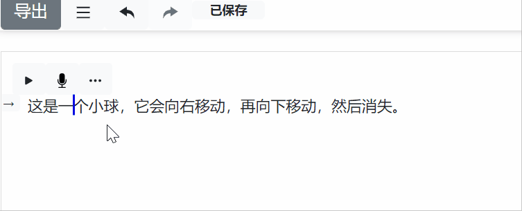
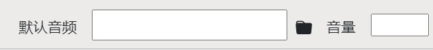

# animeBoard
动画黑板是一个知识类视频制作工具。只需要类似PPT/Keynote的使用门槛和操作方式，就可以快速做出一个直观漂亮的可视化动画视频。

[B站介绍视频](https://www.bilibili.com/video/BV1aa411F7Y2/)
(和剪辑软件的比较)

# 快速入门
本章将带您快速做一个视频。

## 创建项目（文件夹）
初次打开软件，就会有一个弹窗，选择一个空文件夹，作为项目存储的地方。

初始化好后，这个文件夹中就会有一个`.proj`的文件夹，存放编辑文档的所有信息。

## 写文稿
左边框中的写文稿，每一段文字作为一幕（场景）。

## 创建元素
选中任意的文字作为关键词，在出现的工具框中选择方框。

然后，在右边的画面中拖动来创建。

## 调整元素
在元素被聚焦的情况下，到右下角的设置框中设置元素的属性。这里把直角角度变圆弧。

## 创建关键点
在后面的文中选择一处关键点，然后点击`⊕`按钮，可以在当下创建关键点（类似于关键帧）。

此后，拖动右边的元素。元素将会在此关键点产生动画。
然后，点击左侧的预览按钮`▶`效果如下：

类似的，还可以设置消失等动画。

## 录音
每一段单独录音（实践证明每段文字越短，总录音时间就越少）。
点击每段的录音按钮就开始，再点一次开始文字与录音自动对齐。这大概需要几十秒，请耐心等待。在此期间，请不要再点另一个录音按钮。另外，录音请尽量在安静的环境中，噪音会影响识别成功率。

可以反复录音，还可以添加/删除音频。

## 背景音乐
当没有元素聚焦时（或点击画面空白处），再在右下角的设置中设置音频的文件地址，调节音量，就设置了全局的背景（目前还不支持局部的背景声音）。

## 导出视频
**导出的视频前，请先把所有的段落都录音**。
然后点击左上角的导出，设置一下，就可以导出了。

***
以下内容还在施工中。。。

欢迎提issue，还有pull request帮忙修改。
***
# 详细动画介绍
- 文字动画
    - 出现
    - 部分切换
- 画方框(圆)
- 镜头变化
- 元素变化
    - 移动
    - 2D/3D旋转
    - 
- 强调(伴随性)动画
- 序列动画

# 关键点规则
