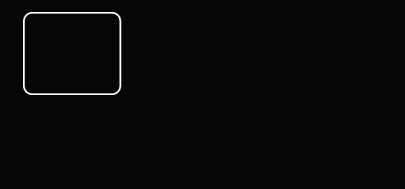
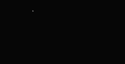
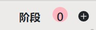
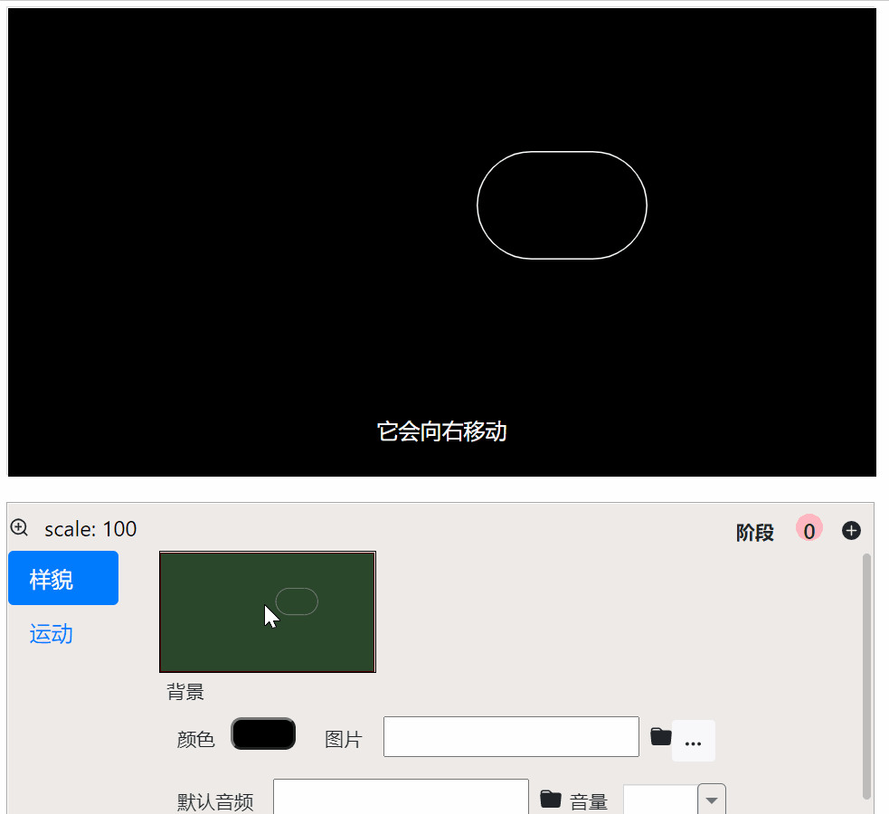

本章将带您了解有关于可视化动画的一切。

## 动画概念
这里的动画，如果用更合适的话，应该叫**动效(motion graphics/design)**。
也就是更多的是关于运动motion的变化，而不是画图画的动画。
在这个软件中，动画主要用在可视化上，可以更好地帮助观众理解内容。

## 动画种类
在软件中，一共有5种动画类型：

### 出现动画 / 消失动画
元素的产生，或消失，所产生的动画。
在右下角的**运动**标签中，可以设置具体的动画方式。

*注：消失动画目前有Bug，所以暂时不能用。*
*还有，这里的动画类型未来可能会发生一些变动。现在就暂时用英文代号。*
#### 出现动画类型
先以基本的方框动画开始
- fadeUp 
- scaleFadeUp 
- appearMoveFade 
- peekIn 
- wideIn 
- flashAppear 
- moveFromCopy 同一页面中，同一类元素（如方框）。
- svgAppear 

### 转换动画
同一个元素，从一种状态转换成另一种状态的过渡动画。这个不需要自己设置。
软件会根据特定的元素类型，自己决定过渡的动画样式。

### 伴随性动画
只要元素在画面中，它就会持续产生（通常是循环）动画。
比如：视频中某一小段时间，只有一张静态的图片，观众容易视觉疲劳。
这时在伴随性动画中设置，比如：slowlyMove(缓慢移动)，视觉效果会好很多。

### 序列性动画
在[元素与关键词](/tutorial/elements-keyword)中，每次元素的变化，都是处于某一个关键词中。
但是，如果现在想要让一个元素按照顺序做多个动画，比如：让一个小球先变大，再移动，再变小。
那么，这样它就需要3个关键词来触发3个动画。那么现在，序列性动画可以让这3个动画合起来，由一个关键词触发。

几乎每个元素，您都可以在元素聚焦后，看到右下设置框的右上角有一排数字。初始时只有一个0。代表一个阶段。
每按一次加号，就可以创建多个阶段。不同的阶段的切换，中间会自动产生过渡动画。

## 不同元素的动画

### 文字动画
文字在做切换动画时，软件会比较前后文本内容，自动判断新加的文字、删除的文字、保留的文字。
针对这3种文字，自动产生对应的动画。

### 镜头变化
没有元素聚焦的时候，右下角显示的就是本场景的设置框。
设置框中的第一个缩略图，反应的就是当前镜头的状态。默认是覆盖全部。
把鼠标放到上面，用鼠标的滚轮上下滚动，您就可以看到，镜头的放大、缩小。
然后，鼠标拖动绿色的覆盖块，就可以移动镜头了。

场景切换的时间若是**0**时（默认），镜头就是突然切换。若需要镜头过渡动画，则设置对应的时间就可以了。

---
以下施工中。。。
---

## 复杂动画

### 等时差动画（瞎编的🤣）
当有许多的元素一起运动的时候，比如一起出现。

那么，同时出现可能不是很好看。
设置每个元素的延迟，按照等差数列，就会出现更好看的群体动画。

这里的延迟设置是按照您选中元素的顺序来安排的。
您可以手动设置元素的聚焦顺序，就可以改变出现的顺序。

