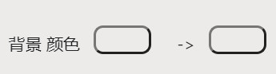
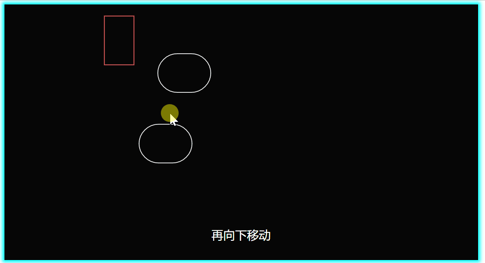

本章将带您介绍右上角画面编辑的所有内容，包括快捷技巧。

## 多个元素的编辑

### 元素多选
有两种方式来选择多个元素。
1. 按住`Ctrl`，鼠标点击多个元素，可以多选。
2. 从空白处拖动，有红色的框涉及的元素均会聚焦。

将以上两种结合，在`Ctrl`按住的情况下，除了框住的元素，之前聚焦的元素也继续聚焦。

### 选择顺序
您在选择元素的先后顺序，将会作为之后设置时的顺序依据。
比如，时间等差延迟、颜色渐变等。

### 多个元素设置
将多个元素选中(聚焦)后，右下的设置框中，有的可以设置渐变的效果，比如：

第一个颜色代表第一个元素，第二个代表最后一个元素。
设置第一个元素的颜色时，会将所有元素统一设置成一样的颜色。
在这个基础上，设置第二个时，除了设置最后一个元素的颜色外，还会设置从第一个到最后一个中间的所有颜色，成渐变颜色。

类似的方法还可以在[制作动画](/tutorial/make-animation)中关于多个元素延迟看到。

## 复制多个元素
如果想把一个元素复制成多个，可以按住`Ctrl`键，然后拖动元素，它就会变成两个。

其实，多个元素聚焦时也是一样，`Ctrl`键按住后，拖动任一聚焦的元素后，全部复制一份。

