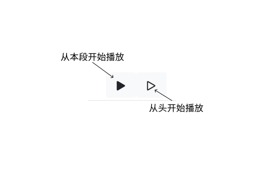
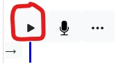
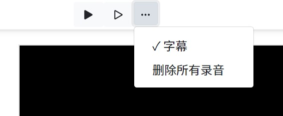

本章将带您了解文稿的全部功能和细节。

首先，文稿在这里相当于是**旁白**，或者说是**解说**。
也就是，视频的播放会完全由文稿的进度来决定的。
所以，文稿一旦确定了，对应的时间轴中每个词出现的时间点也就确定了。

而光标所在的位置，代表当前画面和字幕的时间点。

## 播放预览
点击最上面的两个播放按钮，分别是从本段开始播放、从头开始播放。

点击每一段落上面的播放按钮就可以预览本段。

## 字幕
可以在写文稿时，字幕默认是打开的，在更多按钮中可以设置。

## 语言
支持英文和中文。也就是，它会根据文稿中，中文数量的比例、英文数量的比例，来决定着该文稿的语言。
也就是，不同的文稿可以是不同的语言。这决定着，机器念文稿，以及录音对齐时所采用的语言。

另外，文稿的语言和软件的语言无关。软件的语言在一台电脑上，会一直是一种。