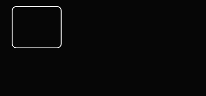
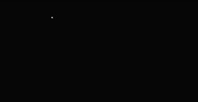

This chapter will take you to know everything about visual animation.

# Basic animation settings

## Animation concept
The animation here, if more appropriate, should be called **motion graphics/design**.
That is, it is more about the movement of the elements than the animation of drawing pictures (such as: whiteboard animation).
In this software, animation is mainly used for content visualization, which can better help the audience understand the content.

## Animation type
In the software, there are 5 animation types:

### Appearing animation / Disappearing animation
The creation or disappearance of elements, the resulting animation.
In the **sports** tab in the lower right corner, you can set specific animation methods.

#### Appears animation type
Let’s start with a basic box animation
-Fade in 
-Zoom in and fade in 
-Move fade in 
-Cut in 
-Wipe in 
-Flash in 
-The copy source is moved into the same page, the same type of element (such as a box).
-Depict 

### Conversion animation
The transition animation of the same element from one state to another state. This does not need to be set by yourself.
The software will decide the transition animation style by itself according to the specific element type.

### Accompanying animation
As long as the element is in the frame, it will continue to produce (usually looping) animations.
For example, there is only one static picture for a short period of time in the video, and the viewer is prone to visual fatigue.
At this time, set it in the accompanying animation, such as: slowlyMove (slowly moving), the visual effect will be much better.

## Animation of different elements

### Text animation
When the text is switching animation, the software will compare the content of the text before and after it, and automatically judge the newly added text, the deleted text, and the retained text.
For these 3 types of text, the corresponding animation is automatically generated.

### Camera changes
When there is no element in focus, the setting frame of this scene is displayed in the lower right corner.
The first thumbnail in the settings box reflects the current camera status. The default is to cover all.
Put the mouse on it, scroll up and down with the mouse wheel, you can see the zoom in and zoom out of the lens.
Then, drag the green covering block with the mouse to move the lens.

If the scene switching time is **0** (default), the lens is suddenly switched. If the camera transition animation is needed, just set the corresponding time.

# Advanced animation settings
Basic animation can already meet most of the needs. Sometimes, in order to pursue better visual effects,
And more refined animation implementation, the following settings may be used.

## Sequential animation
In [Elements and Keywords](/tutorial/elements-keyword), every time an element changes, it is in a certain keyword.
However, if you now want to make an element do multiple animations in sequence, for example, make a small ball first become bigger, then move, and then become smaller.
So, so it needs 3 keywords to trigger 3 animations. So now, sequential animations can combine these three animations and be triggered by a single keyword.

For almost every element, you can see a row of numbers in the upper right corner of the lower right setting box after the element is focused. There is only one 0 at the beginning. Represents a stage.
Each time you press the plus sign, multiple stages can be created. When switching between different stages, transition animations are automatically generated in the middle.

---
The following is under construction. . .
---

## Isochronous animation
When there are many elements moving together, such as appearing together.

Well, the simultaneous appearance may not be very beautiful.
Set the delay of each element, according to the arithmetic sequence, there will be a better-looking crowd animation.

The delay setting here is arranged according to the order of the elements you selected.
You can manually set the focus order of the elements, you can change the order of appearance.
