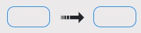
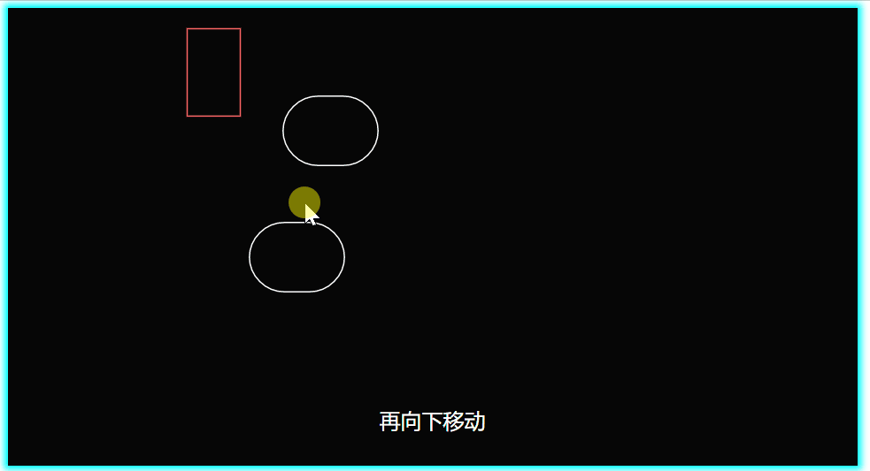

This chapter will take you to introduce all the content of the screen editing in the upper right corner, including shortcut skills.

## Editing multiple elements

### Multiple selection of elements
There are two ways to select multiple elements.
1. Hold down `Ctrl` and click on multiple elements to select multiple elements.
2. Drag from the blank space, the elements involved in the red frame will be focused.

Combining the above two, when the `Ctrl` is held down, in addition to the framed element, the previously focused element will continue to be focused.

### Selection order
The order in which you select the elements will be used as the basis for the order in the subsequent settings.
For example, time arithmetic delay, color gradient, etc.

### Multiple element settings
After selecting (focusing) multiple elements, in the lower right setting box, some can set the gradient effect, such as:

The first color represents the first element, and the second represents the last element.
When setting the color of the first element, all elements will be uniformly set to the same color.
On this basis, when setting the second one, in addition to setting the color of the last element, all the colors from the first to the last are also set as a gradient color.

A similar method can also be seen in [making animation](/tutorial/make-animation) about multiple elements delay.

## Copy multiple elements
If you want to copy one element into multiple, you can hold down the `Ctrl` key and drag the element, it will become two.

In fact, the same is true when multiple elements are focused. After pressing the `Ctrl` key, drag any focused element to copy all of them.
