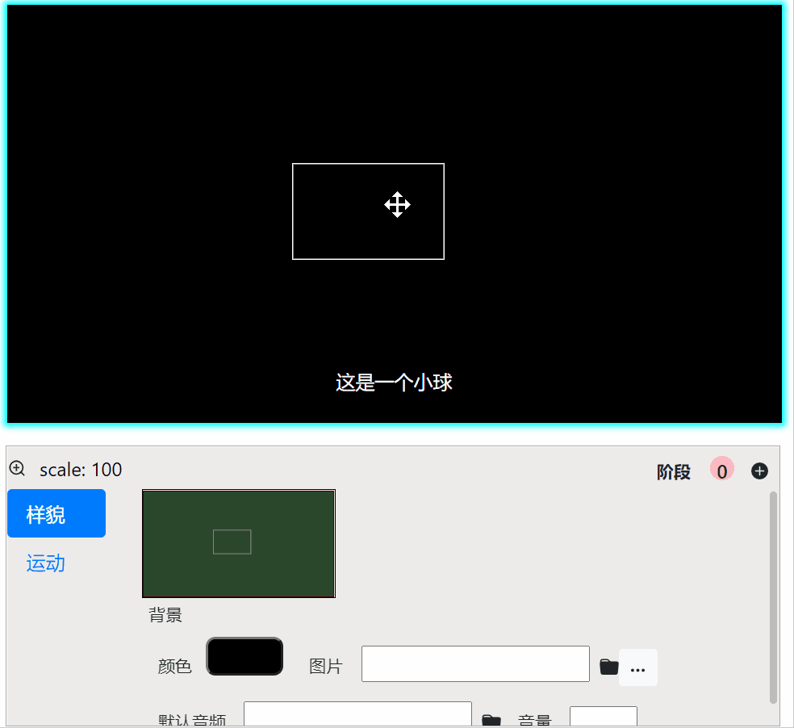

本章将带您快速做一个最简单的视频。

## 下载安装
目前，软件(测试版)下载若有问题请看[视频教程](https://www.bilibili.com/video/BV1aa411F7Y2?p=2&share_source=copy_web)。

## 创建视频项目（文件夹）
初次打开软件，就会有一个弹窗，选择一个空文件夹，作为项目存储的地方。

文件夹目录结构(*软件`打开文件夹`的位置*)：
- `.proj` (*存放必要信息，请不要改动它*)
- 您可以存储任何资源（图片、视频、音频）在**这里**。
- ...

项目文件夹可以整个复制、移动、删除等。和普通的文件夹一样。

## 写文稿
左边框中的写文稿，每一段文字作为一幕（场景）。

如果需要深入了解功能，可以参看[文稿的详细文档](/tutorial/write-narration)

## 创建元素
选中任意的文字作为关键词，在出现的工具框中选择方框。

然后，在右边的画面中拖动来创建。
<!--  -->

关于元素的创建、删除，然后它们与关键词的关系，可以参看[元素与关键词](/tutorial/elements-keyword)

## 调整元素
在元素被聚焦的情况下，到右下角的设置框中设置元素的属性。这里把直角角度变圆弧。

关于详细的画面中元素的编辑，可以参看[画面编辑](/tutorial/monitor-edit)

## 创建关键点
在后面的文中选择一个词，然后点击`⊕`按钮，可以创建元素新的关键点（类似于关键帧）。

这样一个元素就有两个状态(关键词)了。

光标放在第二个关键词或之后，再在画面中改动元素，如：拖动。
然后，点击左侧的预览按钮`▶`效果如下：

播放时，软件自动会将同一个元素的状态切换衔接起来，成为一个`转换动画`。

类似的，还可以设置消失等动画。

**注：鼠标放(悬停)在任一按钮上一小会儿，就会有提示。**

关于更多的动画制作，可以参看[动画制作](/tutorial/make-animation)

## 录音
如果您不想录音，可以直接跳过这一步，在导出时软件会自动加上机读的配音。

每一段单独录音（实践证明每段文字越短，总录音时间就越少）。
点击每段的录音按钮就开始，再点一次开始文字与录音自动对齐。这大概需要几十秒，请耐心等待。在此期间，请不要再点另一个录音按钮。另外，录音请尽量在安静的环境中，噪音会影响识别成功率。

可以反复录音，还可以添加/删除音频。

关于更多的录音与对齐，可以参看[录音和对齐](/tutorial/record-and-align)

## 背景音乐
当没有元素聚焦时（或点击画面空白处），再在右下角的设置中设置音频的文件地址，调节音量，就设置了全局的背景（目前还不支持局部的背景声音）。

## 导出视频
然后点击左上角菜单中`☰`的`导出...`选项，设置一下，就可以导出了。

# 详细文档
详细的文档和视频教程请点击[这里](/tutorial/document-list)

