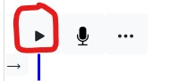
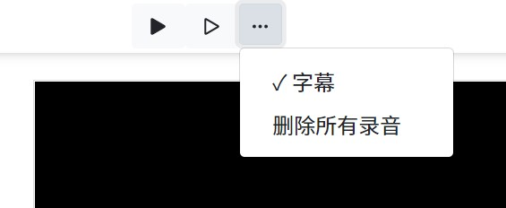

This chapter will take you to understand all the functions and details of the manuscript.

First of all, the manuscript here is equivalent to **narration**, or **commentary**.
That is, the playback of the video will be completely determined by the progress of the manuscript.
Therefore, once the manuscript is determined, the time point at which each word appears in the corresponding timeline is also determined.

The position of the cursor represents the time point of the current picture and subtitles.

## Play preview
Click the top two play buttons to start playing from this section and play from the beginning.

Click the play button above each paragraph to preview the paragraph.

## subtitle
When writing a manuscript, the subtitles are turned on by default and can be set in the more buttons.

## Language
Support English and Chinese. That is, it will determine the language of the manuscript according to the proportion of the number of Chinese and the proportion of the number of English in the manuscript.
That is, different documents can be in different languages. This determines the language used by the machine to read the manuscript and align the recording.

In addition, the language of the manuscript has nothing to do with the language of the software. The language of the software will always be one on a computer.